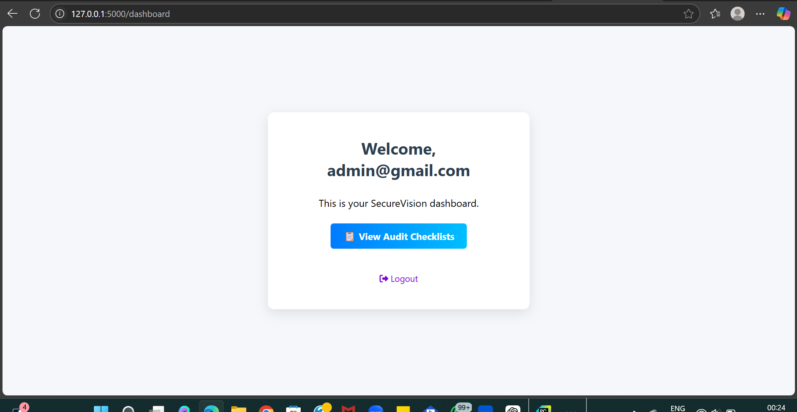
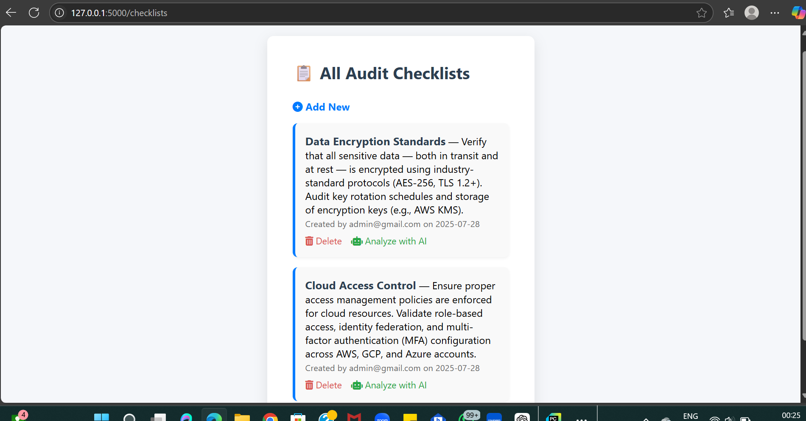
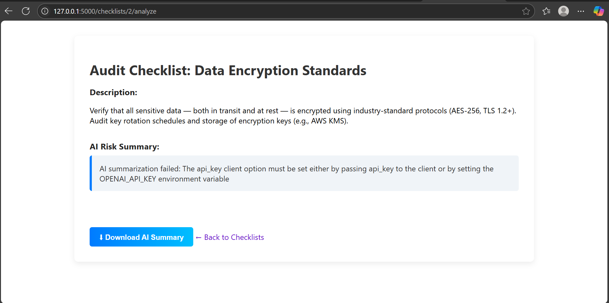

# SecureVision
**AI-powered Audit & Compliance Management System** built with **Flask**, **OpenAI**, and **SQLAlchemy**.

SecureVision simulates a modern cybersecurity audit platform that helps organizations streamline their compliance processes using intelligent automation and NLP-powered risk assessments.

---

## Features

### Core Functionalities
- Create, manage, and delete **Audit Checklists**
- Secure **User Registration & Authentication** (Flask-Login)
- **AI-Powered Analysis**: Use GPT to summarize checklist risk factors and generate compliance insights
- Personalized **User Dashboard** with audit tracking
- Role-based access to analyze/delete only your own checklists

### Smart Add-ons
- Clean, responsive UI (mobile-friendly)
- Flask backend with modular structure (`routes`, `models`, `config`)
- Virtual environment + `requirements.txt` included
- Secrets management via `.env` (OpenAI API key never exposed)

---

## How AI is Used

SecureVision integrates the **OpenAI GPT API** to:
- Understand and **summarize** audit checklists in natural language
- Provide **human-readable insights** from technical audit descriptions
- Simulate how enterprise compliance tools automate risk interpretation

This makes it a perfect demo of **AI in cybersecurity + compliance auditing**.

---

## 🛠️ Tech Stack

| Layer             | Technology                         |
|-------------------|-------------------------------------|
| Backend           | Flask (Python)                     |
| Authentication    | Flask-Login                        |
| ORM / Database    | SQLAlchemy + SQLite                |
| Frontend          | HTML, CSS, Jinja2, FontAwesome     |
| AI Integration    | OpenAI GPT API                     |
| Deployment Ready  | Yes (Local or Cloud with minor tweaks) |

---

## 📸 Screenshots

| Dashboard | Checklists | AI Analysis |
|----------|------------|-------------|
|  |  |  |

---

## Getting Started

### 1. Clone this repo

```bash
git clone https://github.com/gracy1305/SecureVision.git
cd SecureVision
```

### 2. Create a virtual environment
```bash
python -m venv venv
venv\Scripts\activate (Windows)
```

### 3. Install dependencies
```bash
pip install -r requirements.txt
```

### 4. Add your OpenAI API key
Create a .env file (do NOT commit it) and add:
```bash
OPENAI_API_KEY=your_key_here
```

### 5. Run the App
```bash
flask run
```
## 🗂️ Project Structure

```
SecureVision/
├── app/
│   ├── static/
│   │   └── style.css
│   ├── templates/
│   │   ├── checklists/
│   │   │   └── analyze.html
│   │   ├── index.html
│   │   ├── new.html
│   │   ├── base.html
│   │   ├── dashboard.html
│   │   ├── home.html
│   │   ├── login.html
│   │   └── register.html
│   ├── __init__.py
│   ├── forms.py
│   ├── gpt_utils.py
│   ├── models.py
│   └── routes.py
├── screenshots/
│   ├── ai_analysis.png
│   ├── checklists.png
│   └── dashboard.png
├── .gitignore
├── config.py
├── migrations/
├── README.md
├── requirements.txt
├── run.py  # Your Flask entry point
└── venv/
```


## Security Notes
- API keys are excluded via .gitignore
- GitHub push protection is respected
- Clean, public repo for recruiter-friendly viewing

## Use Cases
Demonstrates:
- AI + Security intersection
- Flask app architecture
- Secure authentication
- Product thinking in a simulated enterprise app
Great for:
- Cybersecurity portfolios
- ML/AI-integrated product demos
- Google or FAANG applications
- Technical interviews

Gracy Patel
M.S. Computer Science | DePaul University

## Like This Project?
If this helped or inspired you, please consider ⭐️ starring the repo!
```bash
git clone https://github.com/gracy1305/SecureVision.git
```

## License
This project is for educational and demo purposes only. Not production ready.
```bash
Let me know if you want:
- A shorter version
- A custom badge header
- Or your screenshots embedded!

Once added, your GitHub repo will look ✨ **clean**, **professional**, and **AI-cybersecurity ready** for your resume!
```


